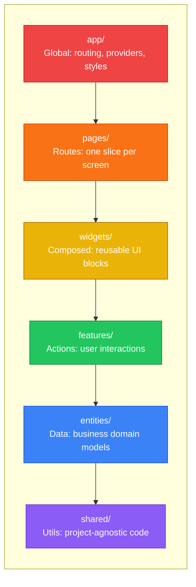
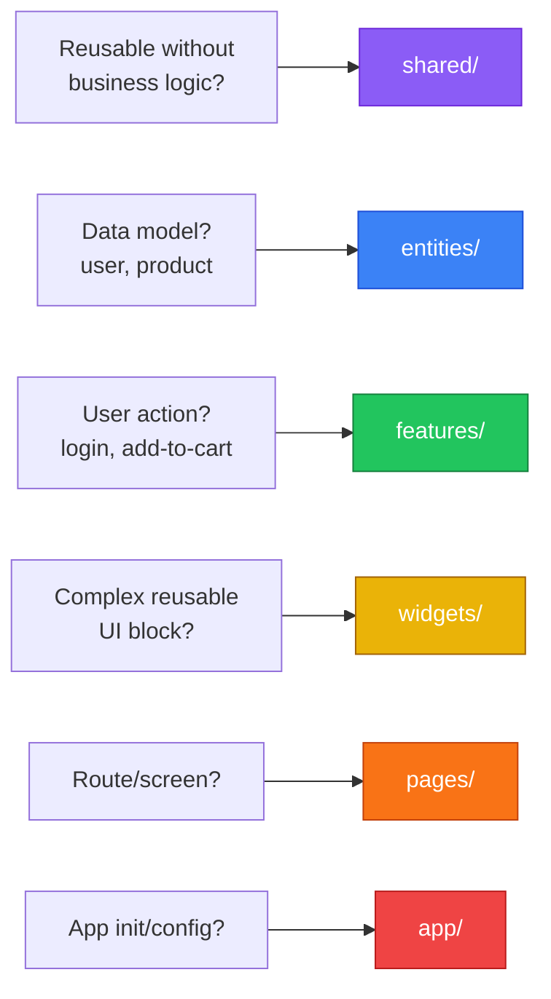

# FSD Quick Reference Cheatsheet

## Layer Hierarchy (Top → Bottom)



**Rule:** Import only from layers BELOW. Never sideways or up.

---

## Quick Decision Tree

### "Where does this code go?"



### "Entity or Feature?"

| Entity (noun) | Feature (verb) |
|---------------|----------------|
| `user` | `auth` (login/logout) |
| `product` | `add-to-cart` |
| `comment` | `write-comment` |
| `order` | `checkout` |

---

## Segment Cheatsheet

| Segment | Purpose | Examples |
|---------|---------|----------|
| `ui/` | Components, styles | `UserCard.tsx`, `Button.tsx` |
| `api/` | Backend calls | `getUser()`, `createOrder()` |
| `model/` | Types, schemas, stores | `User`, `userSchema`, `useUserStore` |
| `lib/` | Slice utilities | `formatUserName()` |
| `config/` | Configuration | Feature flags, constants |

---

## File Structure Templates

### Entity

```
entities/{name}/
├── ui/
│   ├── {Name}Card.tsx
│   ├── {Name}Avatar.tsx
│   └── index.ts
├── api/
│   ├── {name}Api.ts
│   └── index.ts
├── model/
│   ├── types.ts
│   ├── schema.ts
│   ├── store.ts
│   └── index.ts
└── index.ts
```

### Feature

```
features/{name}/
├── ui/
│   ├── {Name}Form.tsx
│   ├── {Name}Button.tsx
│   └── index.ts
├── api/
│   ├── {name}Api.ts
│   └── index.ts
├── model/
│   ├── types.ts
│   ├── schema.ts
│   ├── store.ts
│   └── index.ts
└── index.ts
```

### Page

```
pages/{name}/
├── ui/
│   ├── {Name}Page.tsx
│   └── index.ts
├── api/
│   └── loader.ts       # Optional: data fetching
└── index.ts
```

---

## Public API Pattern

```typescript
// entities/user/index.ts
// UI exports
export { UserCard } from './ui/UserCard';
export { UserAvatar } from './ui/UserAvatar';

// API exports
export { getUser, updateUser } from './api/userApi';

// Model exports
export type { User, UserRole } from './model/types';
export { userSchema } from './model/schema';
export { useUserStore } from './model/store';
```

**Import from public API only:**
```typescript
// ✅ Correct
import { UserCard, type User } from '@/entities/user';

// ❌ Wrong - bypasses public API
import { UserCard } from '@/entities/user/ui/UserCard';
```

---

## TypeScript Path Aliases

```json
{
  "compilerOptions": {
    "baseUrl": ".",
    "paths": {
      "@/*": ["./src/*"]
    }
  }
}
```

---

## Cross-Entity References (@x)

When entities must reference each other:

```
entities/product/@x/order.ts  → API for order to import
```

```typescript
// entities/product/@x/order.ts
export type { ProductId } from '../model/types';

// entities/order/model/types.ts
import type { ProductId } from '@/entities/product/@x/order';
```

---

## Common Anti-Patterns

| ❌ Don't | ✅ Do |
|----------|-------|
| Import from higher layer | Import from lower layers only |
| Cross-slice imports at same layer | Use lower layer or @x notation |
| Generic segments: `components/`, `hooks/` | Purpose segments: `ui/`, `lib/` |
| Wildcard exports: `export *` | Explicit exports |
| Business logic in `shared/` | Keep shared domain-agnostic |
| Single-use widgets | Keep in page slice |

---

## Layer Import Matrix

|  | app | pages | widgets | features | entities | shared |
|--|-----|-------|---------|----------|----------|--------|
| **app** | ✅ | ✅ | ✅ | ✅ | ✅ | ✅ |
| **pages** | ❌ | ❌ | ✅ | ✅ | ✅ | ✅ |
| **widgets** | ❌ | ❌ | ❌ | ✅ | ✅ | ✅ |
| **features** | ❌ | ❌ | ❌ | ❌ | ✅ | ✅ |
| **entities** | ❌ | ❌ | ❌ | ❌ | ❌* | ✅ |
| **shared** | ❌ | ❌ | ❌ | ❌ | ❌ | ✅ |

*Use @x notation for cross-entity references

---

## Minimal FSD Setup

For smaller projects, start with:

```
src/
├── app/          # Required
├── pages/        # Required
└── shared/       # Required
```

Add `entities/`, `features/`, `widgets/` as needed.

---

## Resources

- **Official Docs:** https://feature-sliced.design
- **GitHub:** https://github.com/feature-sliced
- **Examples:** https://github.com/feature-sliced/examples
- **Discord:** https://discord.gg/S8MzWTUsmp
