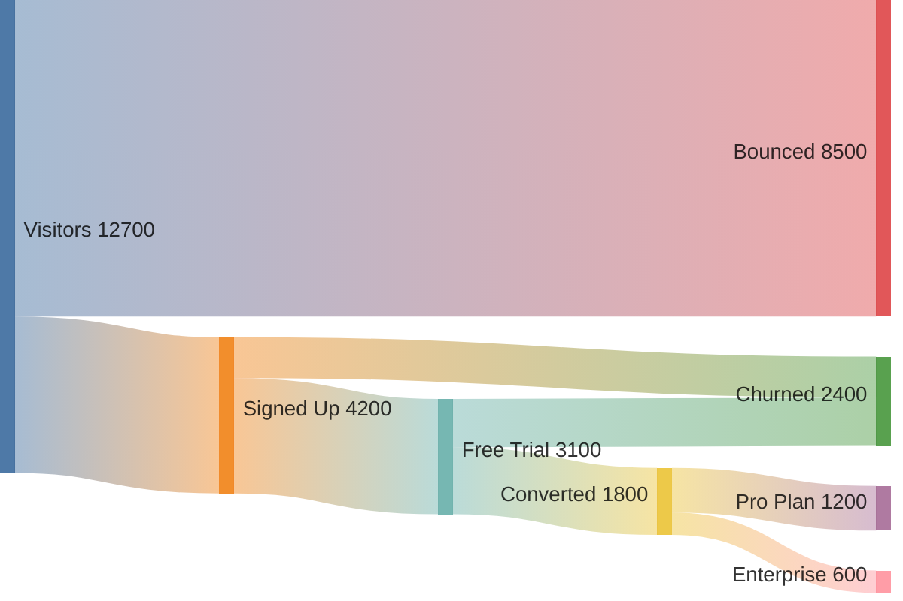
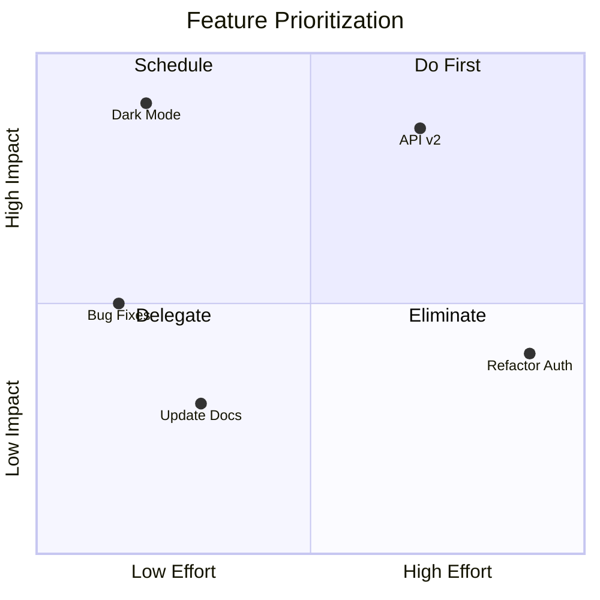
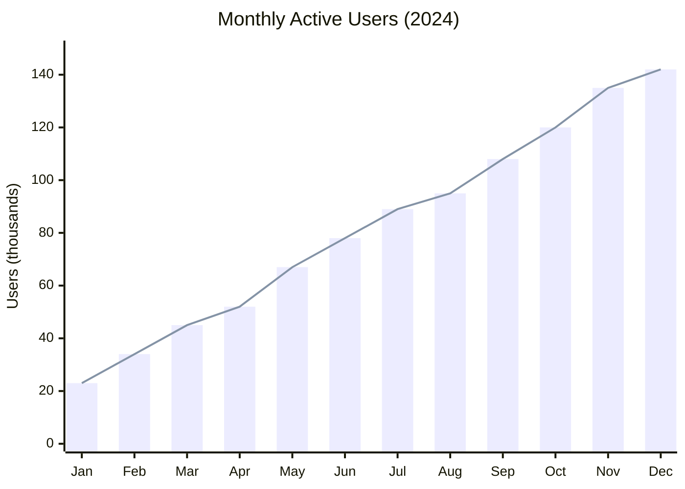

# mermaid-diagrams

Generate Mermaid diagrams in markdown. Claude will automatically use this skill when you ask for diagrams, charts, visualizations, or system documentation.

## Supported Diagram Types

| Category | Diagrams |
|----------|----------|
| **Flows** | Flowchart, Sequence, State |
| **Data Modeling** | Class, ER |
| **Planning** | Gantt, Timeline, Kanban |
| **Visualization** | Pie, Quadrant, XY Chart, Sankey, Treemap |
| **Architecture** | C4, Architecture, Block |
| **Other** | Mindmap, Git Graph, User Journey, Requirement, Packet |

## Example Usage

```
"Create a sequence diagram showing the OAuth flow"
"Draw an ER diagram for a blog database"
"Make a flowchart of the CI/CD pipeline"
"Show me a Gantt chart for sprint planning"
"Create a C4 context diagram for our system"
```

## Skill Structure

- **[SKILL.md](SKILL.md)** - Main skill file (concise overview)
- **Reference Files:**
  - [FLOWCHARTS.md](references/FLOWCHARTS.md) - Flowchart syntax
  - [SEQUENCE.md](references/SEQUENCE.md) - Sequence diagrams
  - [CLASS-ER.md](references/CLASS-ER.md) - Class & ER diagrams
  - [STATE-JOURNEY.md](references/STATE-JOURNEY.md) - State & user journey
  - [DATA-CHARTS.md](references/DATA-CHARTS.md) - Gantt, Pie, Timeline, Charts
  - [ARCHITECTURE.md](references/ARCHITECTURE.md) - C4, Architecture, Block, Kanban
  - [ADVANCED.md](references/ADVANCED.md) - Configuration & styling
  - [CHEATSHEET.md](references/CHEATSHEET.md) - Quick reference

## Did You Know Mermaid Can Do This?






