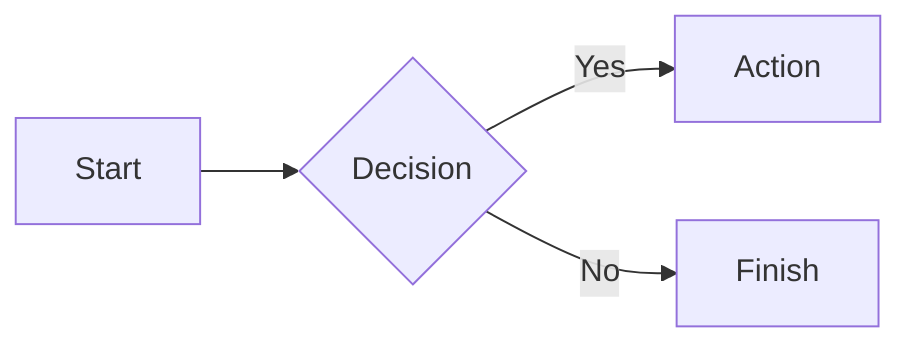
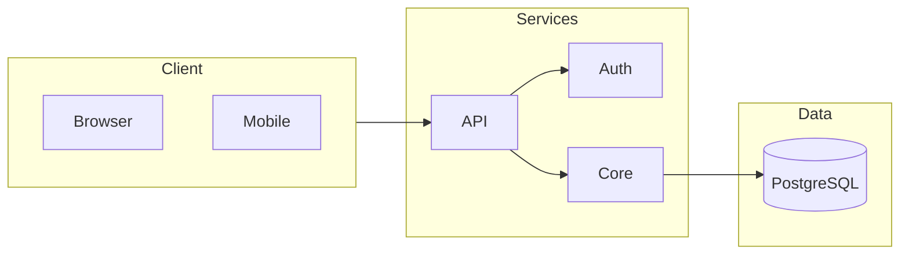
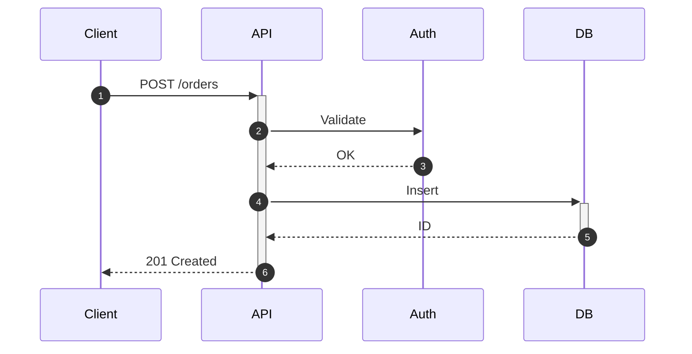
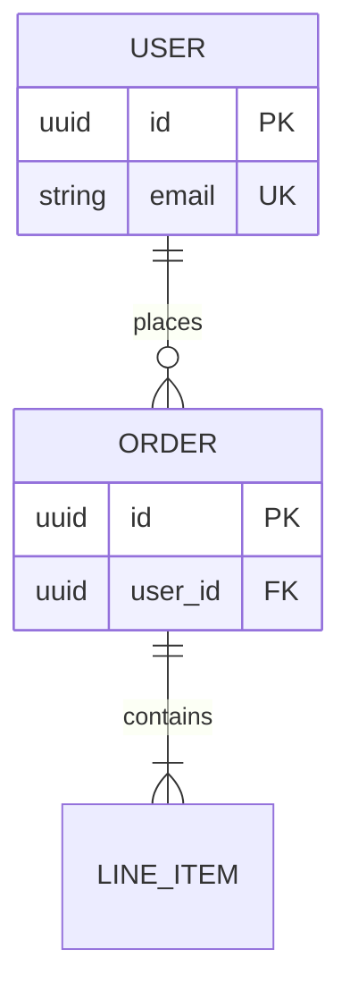
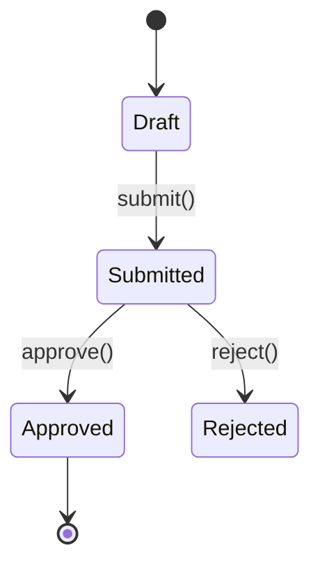

# Mermaid Diagrams

Generate diagrams in markdown that render in GitHub, GitLab, VS Code, Obsidian, Notion. Syntax verified against Mermaid v11.16 (2026).

## Quick Start

````markdown

```mermaid
flowchart LR
    A[Start] --> B{Decision}
    B -->|Yes| C[Action]
    B -->|No| D[Finish]
```
````

## Quick Decision Tree

```
What to visualize?
├─ Process, algorithm, decision flow    → flowchart
├─ API calls, service interactions      → sequenceDiagram
├─ Database tables, relationships       → erDiagram
├─ OOP, type hierarchy, domain model    → classDiagram
├─ State machine, lifecycle             → stateDiagram-v2
├─ System architecture, services        → flowchart + subgraphs (or C4Context / architecture-beta)
├─ Project timeline, sprints            → gantt
├─ Chronological events, milestones     → timeline
├─ User experience, pain points         → journey
├─ Git branches                         → gitGraph
├─ Brainstorming, concept hierarchy     → mindmap
├─ Data distribution                    → pie
├─ Data trends (bar/line)               → xychart
├─ Flow allocation (funnel, budget)     → sankey
├─ Priority matrix                      → quadrantChart
├─ Task board                           → kanban
└─ Network packet layout                → packet
```

Default to `flowchart` when unsure — it handles most "draw the system/process" requests. Prefer plain flowchart + subgraphs over `architecture-beta`/C4 unless the user asks for those specifically, since flowcharts render everywhere.

## Diagram Types

| Type | Declaration | Best For | Status |
|------|-------------|----------|--------|
| Flowchart | `flowchart LR` / `flowchart TB` | Processes, decisions, data flow | Stable |
| Sequence | `sequenceDiagram` | API flows, service calls | Stable |
| ER | `erDiagram` | Database schemas | Stable |
| Class | `classDiagram` | Types, domain models | Stable |
| State | `stateDiagram-v2` | State machines | Stable |
| Gantt | `gantt` | Project timelines | Stable |
| Timeline | `timeline` | Chronological events | Stable |
| Journey | `journey` | User experience mapping | Stable |
| Mindmap | `mindmap` | Brainstorming, hierarchies | Stable |
| Git | `gitGraph` | Branch visualization | Stable |
| Pie | `pie` | Data distribution | Stable |
| Quadrant | `quadrantChart` | Priority matrices | Stable |
| XY Chart | `xychart` | Bar/line data trends | Stable (was `xychart-beta`) |
| Packet | `packet` | Network protocol layouts | Stable (was `packet-beta`) |
| Kanban | `kanban` | Task boards | Stable |
| Block | `block` | Grid-positioned layouts | Stable (was `block-beta`) |
| Sankey | `sankey` | Flow allocation | Experimental (was `sankey-beta`) |
| C4 | `C4Context` etc. | System architecture | Experimental |
| Architecture | `architecture-beta` | Cloud/service topology | Beta |
| Treemap | `treemap-beta` | Hierarchical proportions | Beta |
| Requirement | `requirementDiagram` | Requirements traceability | Stable |

The old `-beta` declarations still parse in Mermaid v11 as legacy aliases. Prefer the stable keyword — but on platforms that bundle an older Mermaid (GitHub lags releases), the `-beta` form may be the only one that renders. When targeting a specific platform, verify with a small test diagram first.

## Common Patterns

### System Architecture


```mermaid
flowchart LR
    subgraph Client
        Browser & Mobile
    end
    subgraph Services
        API --> Auth & Core
    end
    subgraph Data
        DB[(PostgreSQL)]
    end
    Client --> API
    Core --> DB
```

### API Request Flow


```mermaid
sequenceDiagram
    autonumber
    Client->>+API: POST /orders
    API->>Auth: Validate
    Auth-->>API: OK
    API->>+DB: Insert
    DB-->>-API: ID
    API-->>-Client: 201 Created
```

### Database Schema


```mermaid
erDiagram
    USER ||--o{ ORDER : places
    ORDER ||--|{ LINE_ITEM : contains
    USER {
        uuid id PK
        string email UK
    }
    ORDER {
        uuid id PK
        uuid user_id FK
    }
```

### State Machine


```mermaid
stateDiagram-v2
    [*] --> Draft
    Draft --> Submitted : submit()
    Submitted --> Approved : approve()
    Submitted --> Rejected : reject()
    Approved --> [*]
```

## Syntax Quick Reference

### Flowchart Nodes

```
[Rectangle]  (Rounded)  {Diamond}  [(Database)]  [[Subroutine]]
((Circle))   >Asymmetric]   {{Hexagon}}
```

### Flowchart Edges

```
A --> B       # Arrow
A --- B       # Line
A -.-> B      # Dotted arrow
A ==> B       # Thick arrow
A -->|text| B # Labeled
```

### Sequence Arrows

```
->>   # Solid arrow (sync request)
-->>  # Dotted arrow (response)
-x    # Solid arrow with X end (failed)
-)    # Open arrow (async, fire-and-forget)
```

### ER Cardinality

```
||--||   # One to one
||--o{   # One to many
}o--o{   # Many to many
```

## Gotchas That Break Rendering

These are the errors LLMs most often produce. Each one fails to parse or silently renders wrong:

1. **`end` is a reserved word in flowcharts.** A node named `end` (lowercase) breaks the parser because it terminates subgraphs. Use `End`, `e[end]`, or quote it. Same caution applies to nodes named `o` or `x` directly after an edge: `A---oB` parses as a circle-ended edge to `B`, not an edge to node `oB` — add a space or capitalize.

2. **Node IDs must not collide with subgraph IDs.** `subgraph Build` containing a node with ID `Build` throws "would create a cycle". Give the node a different ID and put the display text in brackets: `Compile[Build]`.

3. **Special characters need quotes.** Labels containing `(`, `)`, `[`, `]`, `{`, `}`, `:`, `;`, or starting with a number often break parsing. Wrap the label in double quotes: `A["Fetch (retry x3)"]`. Inside quoted labels, escape with HTML entity codes: `#quot;` for `"`, `#35;` for `#`, `#lt;`/`#gt;` for `<`/`>`.

4. **Comments use `%%` on their own line.** `%% like this`. Do not use `//` or `#`, and do not append `%%` comments to the end of a syntax line — inline trailing comments can break some diagram types.

5. **One diagram per code block, declaration first.** The first non-comment line must be the diagram type (`flowchart LR`, `sequenceDiagram`, ...). A bare `%%{init: ...}%%` directive with no diagram after it fails to render.

6. **ER attribute blocks are line-based.** One attribute per line inside `ENTITY { }` — semicolon-separated attributes on one line fail. Multiple key constraints are comma-separated: `uuid user_id FK, UK`.

7. **Sequence participant names with spaces need aliases.** Use `participant A as API Gateway`, then reference `A` in messages.

8. **Values with hyphens in requirementDiagram must be quoted.** `id: REQ-001` fails; `id: "REQ-001"` works.

## Best Practices

1. **Choose the right type** — Use the decision tree above
2. **Keep focused** — One concept per diagram; split diagrams over ~20 nodes
3. **Use meaningful labels** — Not just A, B, C
4. **Direction matters** — `LR` for flows, `TB` for hierarchies
5. **Group with subgraphs** — Organize related nodes
6. **Validate non-trivial diagrams** — Paste into https://mermaid.live or run `npx -y @mermaid-js/mermaid-cli -i diagram.mmd -o out.svg`

## Reference Documentation

Read the matching reference before generating anything beyond a basic diagram of that type:

| Read | Before generating |
|------|-------------------|
| [references/FLOWCHARTS.md](references/FLOWCHARTS.md) | Flowcharts with shapes, subgraphs, styling, ELK layout, animated edges |
| [references/SEQUENCE.md](references/SEQUENCE.md) | Sequence diagrams with activation, alt/opt/loop/par blocks, notes, boxes |
| [references/CLASS-ER.md](references/CLASS-ER.md) | Class diagrams (generics, annotations, namespaces) or ER schemas |
| [references/STATE-JOURNEY.md](references/STATE-JOURNEY.md) | State machines (composite, fork/join, choice) or user journeys |
| [references/DATA-CHARTS.md](references/DATA-CHARTS.md) | Gantt, pie, timeline, quadrant, xychart, sankey, treemap, mindmap, gitGraph |
| [references/ARCHITECTURE.md](references/ARCHITECTURE.md) | architecture-beta, block, C4, kanban, packet, requirement diagrams |
| [references/ADVANCED.md](references/ADVANCED.md) | Themes, init directives/frontmatter config, styling, security, troubleshooting |
| [references/CHEATSHEET.md](references/CHEATSHEET.md) | Quick syntax lookup across all types; platform support notes |

## Resources

- **Official Documentation**: https://mermaid.js.org
- **Live Editor**: https://mermaid.live
- **GitHub Repository**: https://github.com/mermaid-js/mermaid
- **GitHub Markdown Support**: https://docs.github.com/en/get-started/writing-on-github/working-with-advanced-formatting/creating-diagrams
- **GitLab Markdown Support**: https://docs.gitlab.com/ee/user/markdown.html#diagrams-and-flowcharts
