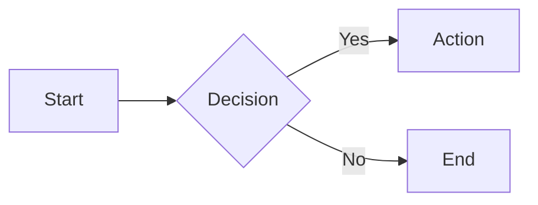
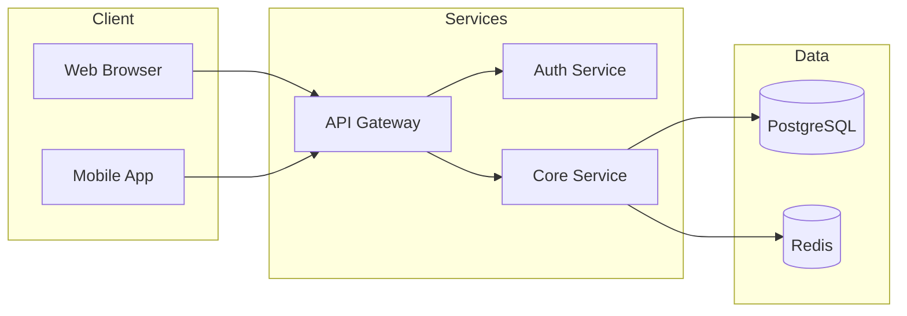
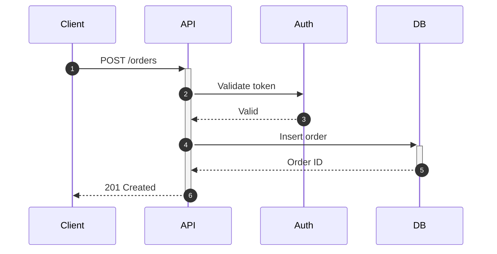
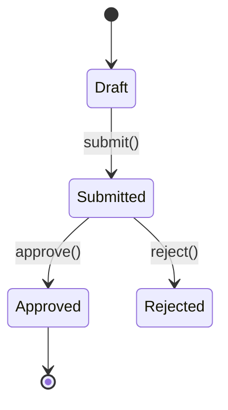

# Mermaid Diagram Generation

Generate diagrams using Mermaid syntax in markdown code blocks. Diagrams render automatically in GitHub, GitLab, Obsidian, Notion, VS Code, and most documentation platforms.

## Quick Start

Wrap diagram code in a fenced code block with `mermaid` language identifier:

````markdown

````

---

## Diagram Types

| Type | Declaration | Use Case |
|------|-------------|----------|
| **Flowchart** | `flowchart` | Processes, algorithms, decision flows |
| **Sequence** | `sequenceDiagram` | API calls, service interactions, protocols |
| **Class** | `classDiagram` | OOP structures, type hierarchies, domain models |
| **ER** | `erDiagram` | Database schemas, data models |
| **State** | `stateDiagram-v2` | State machines, lifecycles |
| **User Journey** | `journey` | User workflows, experience mapping |
| **Gantt** | `gantt` | Project schedules, timelines |
| **Pie** | `pie` | Distribution, percentages |
| **Mindmap** | `mindmap` | Brainstorming, hierarchies |
| **Timeline** | `timeline` | Chronological events |
| **Git Graph** | `gitGraph` | Branch/merge visualization |
| **C4** | `C4Context` | System architecture (context/container/component) |
| **Architecture** | `architecture-beta` | Cloud/CI-CD infrastructure diagrams |
| **Block** | `block-beta` | System component layouts |
| **Quadrant** | `quadrantChart` | Priority matrices, analysis plots |
| **XY Chart** | `xychart-beta` | Line/bar charts |
| **Sankey** | `sankey-beta` | Flow and allocation diagrams |
| **Kanban** | `kanban` | Workflow boards |
| **Packet** | `packet-beta` | Network protocol visualization |
| **Requirement** | `requirementDiagram` | System requirements |
| **Treemap** | `treemap-beta` | Hierarchical data visualization |

---

## When to Use Each Diagram

### System Design
- **Architecture/C4**: High-level system context, service boundaries
- **Flowchart with subgraphs**: Service interactions, data flow
- **Block**: Component layouts, infrastructure

### API & Protocols
- **Sequence**: Request/response flows, authentication, WebSocket
- **State**: Connection lifecycles, protocol states

### Data Modeling
- **ER**: Database schemas with relationships
- **Class**: Domain models, type hierarchies

### Project Management
- **Gantt**: Sprint planning, project timelines
- **Kanban**: Task workflows, sprint boards
- **Timeline**: Roadmaps, milestones

### Analysis
- **Quadrant**: Priority matrices, effort/impact analysis
- **Pie/XY Chart**: Data distribution, trends
- **Sankey**: Budget allocation, user flows
- **User Journey**: UX mapping, pain points

---

## Common Patterns

### System Architecture


### API Request Flow


### Database Schema
```mermaid
erDiagram
    USER ||--o{ ORDER : places
    ORDER ||--|{ LINE_ITEM : contains
    PRODUCT ||--o{ LINE_ITEM : "in"

    USER { uuid id PK; string email UK }
    ORDER { uuid id PK; uuid user_id FK; decimal total }
```

### State Machine


---

## Best Practices

1. **Choose the right diagram type** for your data
2. **Keep diagrams focused** - one concept per diagram
3. **Use meaningful labels** - avoid single letters for complex flows
4. **Add direction hints** - `LR` for timelines, `TB` for hierarchies
5. **Group related items** in subgraphs or composite states
6. **Test rendering** in target platform (GitHub, VS Code, etc.)

---

## Reference Files

For detailed syntax and examples, see:

- **[FLOWCHARTS.md](references/FLOWCHARTS.md)** - Node shapes, edges, subgraphs, styling
- **[SEQUENCE.md](references/SEQUENCE.md)** - Participants, messages, activation, control flow
- **[CLASS-ER.md](references/CLASS-ER.md)** - Class diagrams, ER diagrams, relationships
- **[STATE-JOURNEY.md](references/STATE-JOURNEY.md)** - State diagrams, user journey mapping
- **[DATA-CHARTS.md](references/DATA-CHARTS.md)** - Gantt, Pie, Timeline, Quadrant, XY, Sankey, Treemap
- **[ARCHITECTURE.md](references/ARCHITECTURE.md)** - Architecture, Block, C4, Kanban diagrams
- **[ADVANCED.md](references/ADVANCED.md)** - Configuration, theming, styling, troubleshooting
- **[CHEATSHEET.md](references/CHEATSHEET.md)** - Quick reference for all diagram types

---

## Platform Support

| Platform | Support |
|----------|---------|
| GitHub | Native (since 2022) |
| GitLab | Native (13.0+) |
| VS Code | Markdown Preview Mermaid extension |
| Obsidian | Native |
| Notion | Native |
| Confluence | Plugin available |
| Docusaurus | Plugin available |

## Resources

- **Live Editor**: https://mermaid.live
- **Official Docs**: https://mermaid.js.org
- **GitHub**: https://github.com/mermaid-js/mermaid
